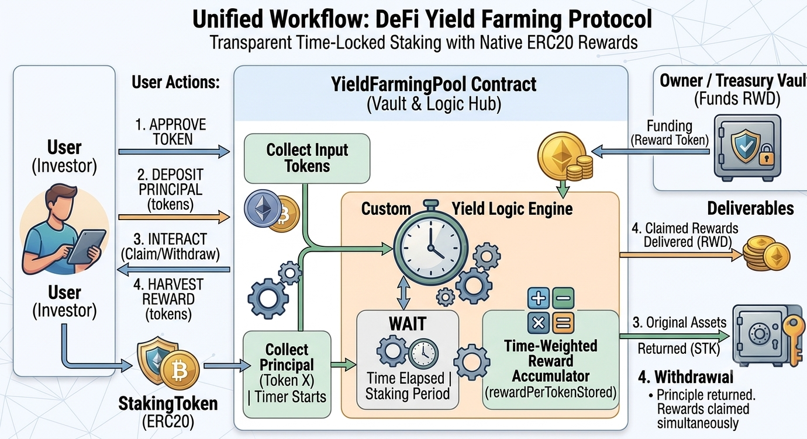

<div align="center">
  <h1>🔄 Yield Farming Pool</h1>
</div>

## 📖 About the Project
The Yield Farming Pool is a robust Web3 smart contract architecture built with Solidity 0.8.30 and engineered using the Foundry development framework. This project serves a dual purpose: providing a secure, time-weighted staking environment for users to earn continuous token rewards, and acting as a masterclass implementation of abi.encodePacked for complex DeFi data structuring.

This architecture is ideal for DAOs, DeFi ecosystems, and protocols looking to incentivize liquidity provision or token holding while maintaining strict state security, collision-resistant data indexing, and optimized gas consumption.

Key Technical Highlights:

* **Solidity 0.8.30**: Leverages modern EVM compiler features for absolute code clarity, safety, and optimal gas optimization.

* **Advanced ABI Encoding**: Features a dedicated library (AbiEncoder) demonstrating how to safely pack data for unique cryptographic pool identifiers, limit orders, flash loans, and cross-chain bridges.

* **OpenZeppelin Integration**: Implements industry-standard IERC20, SafeERC20, Ownable, and ReentrancyGuard libraries to defend against reentrancy, zero-address transfers, and idiosyncratic token behaviors.

* **Foundry Testing Suite**: Validated entirely using Forge, ensuring precise state assertions, edge-case handling, and accurate time-weighted reward emissions.

## ⚙️ How It Works
The core engine is the `YieldFarmingPool` contract. The protocol owner initializes liquidity pools by pairing a specific staking token with a continuous, per-second reward rate. Unlike traditional array-based indexing, each pool generates a unique cryptographic identifier `poolId` via the `AbiEncoder` library, ensuring collision resistance across multiple network deployments.

Users deposit their tokens into these distinct pools. As time progresses, the contract dynamically calculates a global `rewardPerTokenStored` metric based on the pool's reward rate and the total tokens staked. When users interact with the contract (via staking more, withdrawing, or claiming), their pending rewards are automatically calculated against this global metric and safely transferred to their wallets.

### Architecture Diagram



### Core Component File Paths
[`YieldFarmingPool.sol`](./src/YieldFarmingPool.sol) — Core Staking, state management, and Reward Logic.
[`AbiLibrary.sol`](./src/AbiLibrary.sol) — Complex DeFi Data Encoding Library for unique IDs and structures.
[`MockToken.sol`](./src/MockToken.sol) — ERC20 Token Mock implementation for isolated testing environments.
[`YieldScript.s.sol`](./script//YieldScript.s.sol) — Automated deployment and environment scripting.

## 💻 Technical Docs
The primary interaction points for users are stake, withdraw, and claimRewards. The contract ensures that state is meticulously updated before any external transfers occur, adhering strictly to the Checks-Effects-Interactions pattern.

### 1. Staking Tokens
Allows users to deposit ERC20 tokens into a specific active pool. It automatically calculates and distributes any pending rewards prior to increasing the user's principal balance.

```Solidity
    function stake(bytes32 poolId, uint256 amount) external nonReentrant {
        Pool storage pool = s_pools[poolId];
        require(pool.isActive, "Pool is not active");
        require(amount > 0, "Amount must be positive");

        _updatePool(poolId);

        UserInfo storage user = s_userInfo[poolId][msg.sender];

        if (user.amount > 0) {
            uint256 pending = _calculatePendingReward(poolId, msg.sender);
            if (pending > 0) {
                _safeRewardsTransfer(msg.sender, pending);
                emit RewardClaimed(poolId, msg.sender, pending);
            }
        }

        IERC20(pool.token).safeTransferFrom(msg.sender, address(this), amount);

        user.amount += amount;
        user.rewardDebt = user.amount * pool.rewardPerTokenStored / 1e18;
        user.lastClaimTime = block.timestamp;

        pool.totalStaked += amount;

        emit Staked(poolId, msg.sender, amount);
    }
```

### 2. Withdrawing Principal
Users can remove their staked liquidity at any time. Similar to staking, the system updates the global state and harvests pending rewards before returning the initial token deposit to the caller.

```Solidity
    function withdraw(bytes32 poolId, uint256 amount) external nonReentrant {
        Pool storage pool = s_pools[poolId];
        UserInfo storage user = s_userInfo[poolId][msg.sender];

        require(user.amount >= amount, "Insufficient staked amount");

        _updatePool(poolId);

        uint256 pending = _calculatePendingReward(poolId, msg.sender);
        if (pending > 0) {
            _safeRewardsTransfer(msg.sender, pending);
            emit RewardClaimed(poolId, msg.sender, pending);
        }

        user.amount -= amount;
        user.rewardDebt = user.amount * pool.rewardPerTokenStored / 1e18;

        pool.totalStaked -= amount;

        IERC20(pool.token).safeTransfer(msg.sender, amount);

        emit Withdrawn(poolId, msg.sender, amount);
    }
```

### 3. ABI Encoder: Creating Pool Identifiers
A demonstration of the AbiLibrary, which tightly packs parameters and hashes them via keccak256 to create unique, immutable identifiers for protocol mechanics.

```Solidity
    function encodeCreatePoolId(address token, uint256 rewardRate) external view returns(bytes32 poolId) {
        poolId = keccak256(abi.encodePacked(
            token,
            rewardRate,
            block.timestamp,
            block.chainid
        ));
    }
```

## 🚀 Execution Example
The following scenario details how a user capitalizes on time-weighted liquidity placement using this architecture:

- Step 1: Protocol Initialization
The contract owner deploys YieldFarmingPool.sol via YieldScript.s.sol, specifying the designated RewardToken address. The owner then funds the contract's treasury with a large supply of RewardTokens to ensure future payouts.

- Step 2: Pool Creation
The owner calls createPool(address(StakingToken), REWARD_RATE). The contract utilizes the ABI library to generate a unique poolId (e.g., 0x8a...f1), opens the pool to the public, and begins tracking the block timestamp.

- Step 3: User Approval & Staking
A user wishes to stake 1,000 STK tokens. They first call approve() on the STK token contract, granting the pool permission to transfer their tokens. They then execute stake(poolId, 1000 * 10**18). The contract secures their funds and maps their entry position.

- Step 4: Yield Generation
100 seconds pass. At a hypothetical rate of 0.01 reward tokens per second, the contract mathematically allocates 1 reward token to the user based on the time elapsed and their share of the totalStaked pool.

- Step 5: Claiming & Exiting
The user calls withdraw(poolId, 1000 * 10**18). The contract triggers _updatePool(), recognizes the user is owed 1 Reward Token, transfers the 1 Reward Token to their wallet via _safeRewardsTransfer(), and then safely returns their original 1,000 STK tokens.

## ⬆️ Installation

Ensure you have Foundry installed on your machine. Install the required project dependencies (OpenZeppelin Contracts and Forge Standard Library) using the command below:

```Bash
forge install OpenZeppelin/openzeppelin-contracts foundry-rs/forge-std
```

## 🧪 Testing

```Bash
forge test
```

## 📊 Coverage

```Bash
forge test
```

## 📜 Contract Address
(Provide deployed contract addresses here)